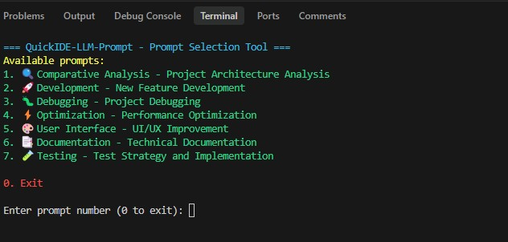
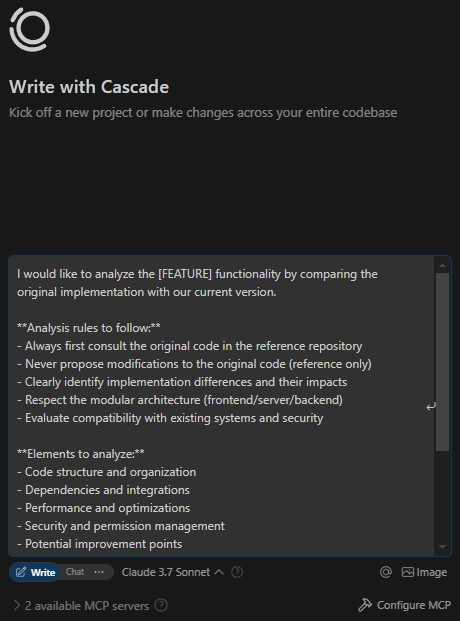

<div align="center">
  
</div>

<div align="center">
  <p><strong>Auroramind</strong> is a French technology company specializing in the development and integration of AI solutions for businesses. With four years of expertise in artificial intelligence systems, we help organizations leverage cutting-edge technology to transform their operations and create value.</p>
</div>

# <div align="center">✨ QuickIDE-LLM-Prompt ✨</div>

<div align="center">
  <p><em>Quick access to optimized prompts for LLM-powered coding assistants in your IDE</em></p>
</div>

---

## 🚀 Overview

**QuickIDE-LLM-Prompt** is a lightweight PowerShell tool that helps developers quickly access and use optimized prompts when working with AI coding assistants in their IDE. It solves the common problem of having to remember or retype complex prompts by providing a simple selection interface that copies the chosen prompt to your clipboard.

### 🤔 Why QuickIDE-LLM-Prompt?

<table>
<tr>
<td width="50%">

- ⏱️ **Save Time**: No more retyping the same prompts over and over
- 🔄 **Improve Consistency**: Use standardized, optimized prompts for better results
- 📈 **Boost Productivity**: Quickly switch between different prompt types based on your current task
- 🛠️ **Easy to Customize**: Add your own prompts to the collection as you discover what works best

</td>
<td width="50%">

- 📝 **Handle Complex Prompts**: Store and reuse sophisticated prompts with multiple instructions
- 📚 **Centralize Knowledge**: Build a library of prompts that have proven effective
- 🧠 **Overcome LLM Limitations**: Address the common problem where IDE-integrated LLMs forget instructions
- 🔄 **Maintain Context**: Ensure your AI assistant remembers critical project architecture and rules

</td>
</tr>
</table>

## 📋 Features

<div style="display: flex; justify-content: space-between;">
<div style="width: 48%;">

### Core Features
- ✅ **Simple Selection Interface**: Easy-to-use menu for selecting prompts
- ✅ **Organized by Categories**: Prompts are grouped by task type
- ✅ **Instant Clipboard Copy**: Selected prompts are automatically copied
- ✅ **Customizable**: Add your own prompts to the collection

</div>
<div style="width: 48%;">

### Advanced Features
- ✅ **Lightweight**: No dependencies, just a simple PowerShell script
- ✅ **Support for Complex Prompts**: Store prompts with detailed instructions
- ✅ **Context Reinforcement**: Easily remind your AI assistant about project architecture
- ✅ **IDE Integration**: Quick access via keyboard shortcuts

</div>
</div>

## 🖼️ Screenshots

<div align="center">
  
  <p><em>Main selection menu</em></p>
  
  
  <p><em>Prompt pasted into the LLM chat interface</em></p>
</div>

## 🛠️ Installation

### Prerequisites

- Windows with PowerShell 5.1 or later
- Any IDE with an LLM-powered coding assistant (VS Code, Visual Studio, JetBrains IDEs, etc.)

### Setup

1. Clone this repository or download the files:
   ```powershell
   git clone https://github.com/syl2042/QuickIDE-LLM-Prompt.git
   ```

2. Place the files in a convenient location on your system.

3. (Optional) Add a shortcut to the script for quick access:
   - Right-click on `QuickIDE-LLM-Prompt.ps1`
   - Select "Create shortcut"
   - Move the shortcut to a convenient location or pin it to your taskbar

### Project-Specific Installation

To use QuickIDE-LLM-Prompt directly within your development project:

1. Create a `.scripts` or `.tools` directory in your project root:
   ```powershell
   mkdir .scripts
   ```

2. Copy the necessary files to this directory:
   ```powershell
   Copy-Item -Path "path\to\QuickIDE-LLM-Prompt.ps1" -Destination ".scripts\"
   Copy-Item -Path "path\to\PROMPTS.md" -Destination ".scripts\"
   ```

3. Launch the script from your IDE's integrated terminal:
   ```powershell
   .\.scripts\QuickIDE-LLM-Prompt.ps1
   ```

4. For even faster access, check out the VS Code integration below!

### VS Code Integration

Want to launch the prompt selector with a keyboard shortcut? Here's how:

1. Create a VS Code task in `.vscode/tasks.json` (create the file if it doesn't exist):
   ```json
   {
       "version": "2.0.0",
       "tasks": [
           {
               "label": "Launch QuickIDE-LLM-Prompt",
               "type": "shell",
               "command": "powershell",
               "args": ["-ExecutionPolicy", "Bypass", "-File", "${workspaceFolder}\\.scripts\\QuickIDE-LLM-Prompt.ps1"],
               "problemMatcher": []
           }
       ]
   }
   ```

2. Add a keyboard shortcut in `.vscode/keybindings.json` (or via Preferences):
   ```json
   {
       "key": "ctrl+alt+p",
       "command": "workbench.action.tasks.runTask",
       "args": "Launch QuickIDE-LLM-Prompt"
   }
   ```

3. Now just hit `Ctrl+Alt+P` to launch the prompt selector directly from VS Code. Magic! ✨

## 📝 Usage

### Basic Usage

1. Run the PowerShell script:
   ```powershell
   .\QuickIDE-LLM-Prompt.ps1
   ```

2. Select a prompt from the menu by entering its number.

3. The selected prompt is automatically copied to your clipboard.

4. Paste the prompt into your IDE's LLM chat interface and customize the placeholders (text in [BRACKETS]).

### Using with a Custom Prompts File

Got prompts stored somewhere else? No problem:

```powershell
.\QuickIDE-LLM-Prompt.ps1 "C:\path\to\your\custom-prompts.md"
```

## 📄 Customizing Prompts

The prompts are stored in the `PROMPTS.md` file using a simple format:

```markdown
## 1. 🚀 Category Name

### Prompt Title

```prompt
Your prompt content goes here.
Replace [PLACEHOLDERS] with specific information when using the prompt.
```
```

To add your own prompts:

1. Open `PROMPTS.md` in any text editor.
2. Follow the existing format to add new categories or prompts.
3. Save the file.
4. Your new prompts will appear the next time you run the script.

## 🤝 Contributing

Contributions are welcome! If you have prompts that work well for specific coding tasks, please consider sharing them:

1. Fork the repository
2. Add your prompts to the PROMPTS.md file
3. Submit a pull request

## 📜 License

This project is licensed under the MIT License - see the [LICENSE](LICENSE) file for details.

## 🙏 Acknowledgements

- Inspired by the need for quick access to optimized prompts when working with AI coding assistants
- Thanks to all contributors who have shared their effective prompts

---

<div align="center">
  <p>Made with ❤️ by <a href="https://auroramind.fr">Auroramind</a> for developers working with AI coding assistants</p>
  <p>Happy prompting! 🚀</p>
</div>
